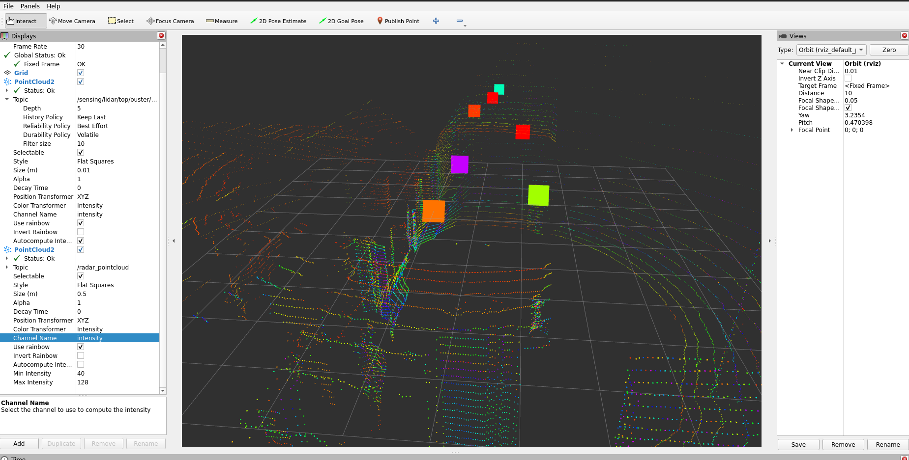

# ARS408 ROS2 Dual Radar Driver

ROS2 driver for the Continental ARS408-21 radar sensor, extended to support **two radar units operating simultaneously on the same CAN bus**.

This work is based on the original [TIER IV implementation](https://github.com/tier4/ars408_driver) and was developed during an internship at **UNISA-DIEM** (Università degli Studi di Salerno), under the supervision of Prof. Diego Gragnaniello.

---

## What was changed from the original driver

The original TIER IV driver supports only one radar unit with hardcoded CAN IDs. The following modifications were made to support two radars simultaneously:

| File | Change |
|------|--------|
| `ars408_constants.hpp` | CAN ID constants renamed to `_BASE` (e.g. `OBJ_STATUS_BASE`) |
| `ars408_driver.hpp` | Added `sensor_id_` attribute and dynamic CAN ID variables |
| `ars408_driver.cpp` | Added `Init(sensor_id)` function + replaced `switch/case` with `if/else if` |
| `ars408_ros_node.cpp` | Added `sensor_id` ROS2 parameter with validation (0–7) |
| `config/radar_front.yaml` | Configuration file for radar front (SensorID=0) |
| `config/radar_rear.yaml` | Configuration file for radar rear (SensorID=1) |
| `launch/dual_radar.launch.xml` | Launch file to run both radars simultaneously |

---

## How it works

The Continental ARS408-21 supports up to 8 sensors on the same CAN bus using the **SensorID** mechanism. Each radar can be assigned a unique SensorID (0 to 7), which shifts all its CAN message IDs by an offset:

```
MsgId = MsgId_BASE + SensorId * 0x10
```

### Example with two radars

| Message | SensorID=0 (radar front) | SensorID=1 (radar rear) |
|---------|--------------------------|-------------------------|
| RadarState | 0x201 | 0x211 |
| Obj_Status | 0x60A | 0x61A |
| Obj_General | 0x60B | 0x61B |
| Obj_Quality | 0x60C | 0x61C |
| Obj_Extended | 0x60D | 0x61D |

> **Exception:** The relay control message `0x8` always keeps the same ID regardless of SensorID (Continental documentation, section 7.6).

Each driver instance reads its `sensor_id` from a YAML configuration file, computes the correct CAN IDs at startup via `Init()`, and filters incoming CAN frames accordingly. This ensures full isolation between the two radar data streams.

---

## Prerequisites

- ROS2 Humble (Ubuntu 22.04)
- `ros-humble-can-msgs`
- `ros-humble-radar-msgs`
- `ros-humble-ros2-socketcan`
- A CAN interface (e.g. `can0`) connected to the radar(s)

Install dependencies:

```bash
cd ~/ros2_ws_ars408
rosdep install --from-paths src --ignore-src -r -y
```

---

## Build

```bash
cd ~/ros2_ws_ars408
source /opt/ros/humble/setup.bash
colcon build --symlink-install
source install/setup.bash
```

---

## Configuration

Each radar is configured via a YAML file in the `config/` directory.

### `config/radar_front.yaml` (SensorID = 0)

```yaml
/**:
  ros__parameters:
    sensor_id: 0
    output_frame: "radar_front"
    publish_radar_track: true
    publish_radar_scan: false
    sequential_publish: false
    size_x: 1.8
    size_y: 1.8
```

### `config/radar_rear.yaml` (SensorID = 1)

```yaml
/**:
  ros__parameters:
    sensor_id: 1
    output_frame: "radar_rear"
    publish_radar_track: true
    publish_radar_scan: false
    sequential_publish: false
    size_x: 1.8
    size_y: 1.8
```

### Parameter description

| Parameter | Type | Description |
|-----------|------|-------------|
| `sensor_id` | int (0–7) | Radar SensorID — determines the CAN ID offset |
| `output_frame` | string | Frame ID used in published ROS2 message headers |
| `publish_radar_track` | bool | Publish `RadarTracks` on `~/output/objects` |
| `publish_radar_scan` | bool | Publish `RadarScan` on `~/output/scan` |
| `sequential_publish` | bool | If true, publish each object as soon as received |
| `size_x` / `size_y` | double | Default object size in meters (used when radar does not provide dimensions) |

---

## Configuring SensorID via RadarCfg (CAN ID `0x200`)

Before connecting both radars on the same CAN bus, each unit must be assigned a unique SensorID. This is done by sending a `RadarCfg` message to the radar **while it is the only device on the bus**, to avoid any ID collision.

### Step 1 — Connect only one radar at a time

Do not connect both radars simultaneously during this procedure. Configure each unit individually, then connect them together once both SensorIDs are set.

### Step 2 — Bring up the CAN interface

```bash
sudo ip link set can0 up type can bitrate 500000
```

### Step 3 — Send the RadarCfg frame

To assign **SensorID = 1** to the rear radar and persist it across power cycles:

```bash
cansend can0 200#8200000001800000
```

> For the front radar (SensorID = 0): no change needed if the radar ships with SensorID = 0 by default. You can confirm by observing CAN traffic on IDs `0x60A–0x60D`.

### Frame breakdown

The `RadarCfg` message is 8 bytes (64 bits), encoded in **Little Endian** as defined in the Continental ARS408-21 documentation (Table 2, p. 12).

```
Payload:  82 00 00 00 01 80 00 00
Byte:      0   1   2   3   4   5   6   7
```

| Signal | Bit(s) | Value | Meaning |
|--------|--------|-------|---------|
| `RadarCfg_SensorID_valid` | bit 1 | `1` | Authorize SensorID change |
| `RadarCfg_StoreInNVM_valid` | bit 7 | `1` | Authorize NVM write |
| `RadarCfg_SensorID` | bits 32–34 | `1` | New SensorID = 1 |
| `RadarCfg_StoreInNVM` | bit 47 | `1` | Persist across power cycles |

**Byte-level explanation:**

```
Byte 0 = 0x82 = 1000 0010b  →  bit 7 (StoreInNVM_valid) + bit 1 (SensorID_valid)
Byte 4 = 0x01 = 0000 0001b  →  bit 32 set → SensorID = 1
Byte 5 = 0x80 = 1000 0000b  →  bit 47 set → StoreInNVM = 1
Bytes 1,2,3,6,7 = 0x00      →  unused / not valid
```

### Step 4 — Verify with candump

Before sending the frame, `candump can0` shows:

```
can0  60A  [8]  ...   # Obj_Status  (SensorID=0)
can0  60B  [8]  ...   # Obj_General (SensorID=0)
can0  60D  [8]  ...   # Obj_Extended (SensorID=0)
```

After sending, the IDs shift to:

```
can0  61A  [8]  ...   # Obj_Status  (SensorID=1) ✓
can0  61B  [8]  ...   # Obj_General (SensorID=1) ✓
can0  61D  [8]  ...   # Obj_Extended (SensorID=1) ✓
```

This confirms the formula: `MsgId = MsgId_BASE + SensorId × 0x10`

> **Important:** After this change, any future `RadarCfg` messages for this radar must be sent to **`0x210`** (not `0x200`), since the radar now only listens on its shifted CAN ID. The `0x200` ID will no longer be acknowledged by this unit.

### Step 5 — Repeat for the other radar

Disconnect the first radar, connect the second unit, and repeat Step 3 with the appropriate SensorID value.

### Step 6 — Connect both radars and launch

Once both radars are configured with different SensorIDs, connect them together on the CAN bus and run:

```bash
ros2 launch pe_ars408_ros dual_radar.launch.xml
```

---

## Running two radars simultaneously

### Step 1 — Set up the CAN interface

```bash
sudo ip link set can0 up type can bitrate 500000
```

### Step 2 — Launch both radars

```bash
ros2 launch pe_ars408_ros dual_radar.launch.xml
```

This launches:
- One `socketcan` receiver on `can0` (shared by both radars)
- One driver instance for radar front (`namespace: radar_front`, `sensor_id: 0`)
- One driver instance for radar rear (`namespace: radar_rear`, `sensor_id: 1`)

### Step 3 — Verify the output topics

```bash
ros2 topic list
```

You should see:

```
/radar_front/output/objects
/radar_rear/output/objects
```

To verify data isolation (no cross-contamination):

```bash
ros2 topic echo /radar_front/output/objects
ros2 topic echo /radar_rear/output/objects
```

---

## Architecture

```
CAN bus (can0)
      │
socketcan_bridge
      │ /sensing/radar/can_tx
      │
      ├──────────────────────────────────┐
      │                                  │
ARS408 Node (radar_front)        ARS408 Node (radar_rear)
sensor_id = 0                    sensor_id = 1
Listens: 0x60A, 0x60B...         Listens: 0x61A, 0x61B...
      │                                  │
/radar_front/output/objects      /radar_rear/output/objects
```

---

## Assumptions

- Both radars must be pre-configured with different SensorIDs before connecting to the CAN bus. SensorID can be set via the `RadarCfg` message (CAN ID `0x200`) with `RadarCfg_SensorID_valid = 1` and `RadarCfg_StoreInNVM = 1` to persist across power cycles.
- The CAN bus bitrate is **500 kbit/s** as specified in the Continental ARS408-21 documentation.
- The driver assumes the radar is configured to output **objects** (`RadarCfg_OutputType = 0x1`). Cluster output is not handled by this driver.
- `PointCloud2` output is not natively published. If required for visualization or downstream processing, a dedicated conversion node should be used.

---

## Repository structure

```
ars408_driver/
    CAN_Recording/          Real CAN log recorded on MiviaCar (candump format)
    config/                 YAML configuration per radar (front / rear)
    docs/                   Documentation
        DEMO_REALTIME_RVIZ2.md    Real-time demo procedure (radar + LiDAR in RViz2)
        VALIDATION_RESULTS.md     Validation report on MiviaCar hardware
        images/                   Result screenshot
    include/ars408_ros/     C++ headers
    launch/                 ROS2 launch files (single radar, dual radar, pointcloud)
    matlab/                 CAN log analysis script
    scripts/                launch_radar_miviaCar.sh — one-shot pipeline startup
    src/                    C++ sources (driver, node, pointcloud converter)
```

---

## Documentation

| Document | Content |
|----------|---------|
| [docs/DEMO_REALTIME_RVIZ2.md](docs/DEMO_REALTIME_RVIZ2.md) | Step-by-step real-time demo: radar pipeline on can1, TF setup, RViz2 configuration, verification checklist, troubleshooting |
| [docs/VALIDATION_RESULTS.md](docs/VALIDATION_RESULTS.md) | Validation report on MiviaCar: architecture, measured rates, detected objects, TF explanation, bag replay procedure |

Result — radar detections (large squares) overlaid on the Ouster LiDAR
point cloud in RViz2:



---

## References

- Continental ARS408-21 Technical Documentation V1.8 (October 2017)
- [TIER IV original driver](https://github.com/tier4/ars408_driver)
- ROS2 Humble documentation

---

## Author

**Abdelmoutalib Douadi**  
4th Year Engineering Student — Mechatronics and Embedded Systems (MeSE)  
ESIX Normandie — Université de Caen Normandie  
Intern at UNISA-DIEM, Fisciano (Italy) — 2026
